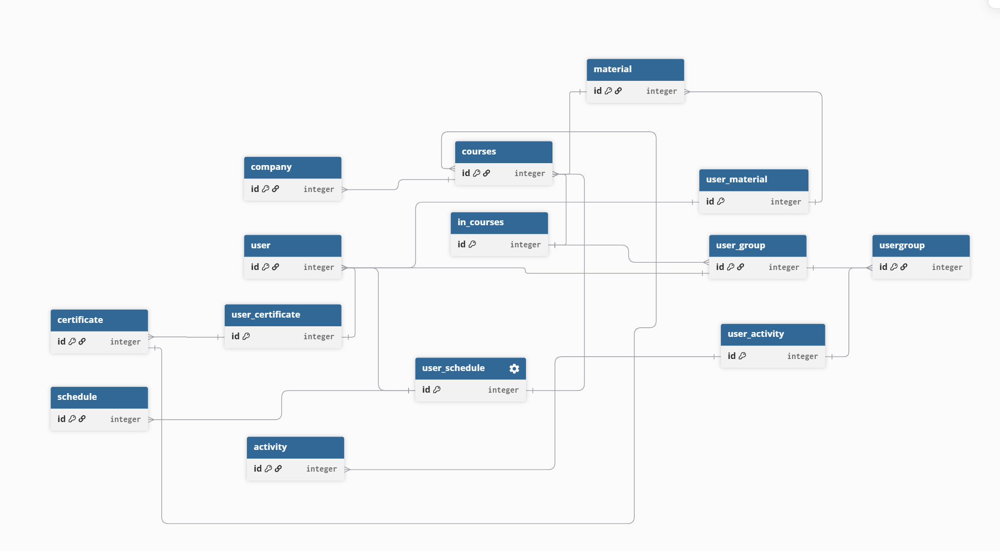

## Project description of language platform

Project general purpose is to create platform for different language schools to use to enhance learning planning and make processes going with it more efficient.

### General requirements

- System level
    - The **platform operator** runs the SaaS. System-level roles manage the platform itself.
    - **SystemAdmin**
        - Full access. Manage companies, subscriptions, billing, system config, feature flags. View cross-tenant analytics. Impersonate company users for support.
    - **SystemSupport**
        - View-only access to company data for troubleshooting. Create support tickets. Cannot modify billing or system config.
    - **SystemBilling**
        - Manage subscription plans, pricing tiers, invoices, payment status. Cannot access company operational data.
- Comapany level
    - Each **company** is an isolated tenant. Company-level roles manage operations within that tenant.
    - **CompanyOwner**
        - Full control within tenant. Manage company settings, users, roles, subscription tier. Transfer ownership. Cannot access other tenants.
    - **CompanyAdmin**
        - Manage users, roles, and all operational data within tenant. Cannot change subscription or billing.
    - **CompanyManager**
        - Full CRUD on operational entities (business-specific data). Can view reports. Cannot manage users or company settings.
    - **CompanyEmployee**
        - Limited CRUD — create and view own work, edit assigned records. Read-only on shared reference data.
- Multi tendants requirements
    - **Data isolation**: Tenant data is strictly isolated. Queries always filter by `CompanyId`. No cross-tenant data leaks.
    - **Path-based routing**: `bikerental.io/acme`
    - **Company registration & onboarding**: Self-service signup creates a new tenant with a CompanyOwner user.
    - **Subscription tiers**: Free (limited), Standard, Premium — affecting feature access, entity limits, or user counts.
    - **Audit trail**: Log who changed what and when, per tenant.
    - **Soft delete**: No hard deletes on business entities. Deactivated companies retain data but lose access.
- Identity and authentication
    - ASP.NET Core Identity with per-tenant user management
    - Users can belong to multiple companies (e.g., a person working for multiple rental shops)
    - Role-based authorization via `[Authorize(Roles = "...")]`
    - Login, registration, password reset

### Platform specific requirements

- It has to be able to accommodate different language schools
    - different language courses
    - CEFR levels
    - durations
    - class size config
    - placement test: each language school own or platform certified test - teachers can change in 2 weeks

- Track student progress
    - levels
    - languages
    - schedule
    - retakes
    - attendance tracking
    - certificates

- Teachers
    - teacher certificate: native, non-native
    - availability
    - schedule

## ERD scheme

### Version 1 without attributes

| Table name | Description |
| ---------- | ----------- |
| user       | users represent all the individuals who are on the platform |
| company    | All the companies represented on the platform |
| courses    | Courses of different languages and levels under companies |
| material   | Material needed or related to the courses |
| user_material | Many to many table to represent which materials users have |
| in_ courses | Many to many to represent what users in which user groups are in the courses and if they have access or subscription or if they have passed the test |
| certificate | Different obtainable certificates - do I need certificate_liik?|
| user_certificate | Many to many to say what certificates users have |
| user_group | Many to many to represent in which user role the user has |
| usergroup | Different user groups like teacher, student, admin |
| usergroup_activity | Many to many to represent which activities are allowed in certain user groups |
| Activity | Activities that are possible to do on the platform |
| user_schedule | Many to many to represent certain user or course availability |
| schedule | Different time blocks for scheduling |