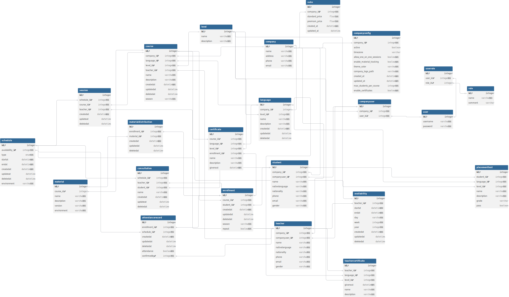

## Project description of language platform

Project general purpose is to create platform for different language schools to use to enhance learning planning and make processes going with it more efficient.

### General requirements

- Multi tendants requirements
    - **Data isolation**: Tenant data is strictly isolated. Queries always filter by `CompanyId`. No cross-tenant data leaks.
    - **Path-based routing**: `bikerental.io/acme`
    - **Company registration & onboarding**: Self-service signup creates a new tenant with a CompanyOwner user.
    - **Subscription tiers**: Free (limited), Standard, Premium — affecting feature access, entity limits, or user counts.
    - **Audit trail**: Log who changed what and when, per tenant.
    - **Soft delete**: No hard deletes on business entities. Deactivated companies retain data but lose access.
- Identity and authentication
    - ASP.NET Core Identity with per-tenant user management
    - Users can belong to multiple companies (e.g., a person working for multiple rental shops)
    - Role-based authorization via `[Authorize(Roles = "...")]`
    - Login, registration, password reset
  
      | Role | Description |
      | ---------- | ----------- |
      | SystemAdmin | Full access. Manage companies, subscriptions, billing, system config, feature flags. View cross-tenant analytics. Impersonate company users for support. |
      | SystemSupport | View-only access to company data for troubleshooting. Create support tickets. Cannot modify billing or system config. |
      | SystemBilling | Manage subscription plans, pricing tiers, invoices, payment status. Cannot access company operational data. |
      | CompanyOwner | Full control within tenant. Manage company settings, users, roles, subscription tier. Transfer ownership. Cannot access other tenants. |
      | CompanyAdmin | Manage users, roles, and all operational data within tenant. Cannot change subscription or billing. |
      | CompanyManager | Full CRUD on operational entities (business-specific data). Can view reports. Cannot manage users or company settings. |
      | CompanyEmployee | Limited CRUD — create and view own work, edit assigned records. Read-only on shared reference data. |
  
    #### Webapp basic implementation (only main access)
- **SystemAdmin**
  - every role based function
- **SystemSupport**
  - Tickets
  - Read-only across tenants
- **SystemBilling**
  - Subscription plan CRUD access
  - Pricing tiers access
  - Invoice access
  - Can see payment status
- **CompanyOwner**
  - Company insider all rights
  - Subscription plans
  - Change owner
  - CRUD tenant
- **CompanyAdmin**
  - CRUD teacher, student, manager accounts
  - Operational data like enabling attendance record
- **CompanyManager**
  - CRUD course
  - CRUD schedule
- **CompanyEmployee (student, teacher)**
  - CRUD their own work
      
### Platform specific requirements

- It has to be able to accommodate different language schools
    - different language courses
    - CEFR levels
    - durations
    - class size config
    - placement test: each language school own or platform certified test - teachers can change in 2 weeks

- Track student progress
    - levels
    - languages
    - schedule
    - retakes
    - attendance tracking
    - certificates

- Teachers
    - teacher certificate: native, non-native
    - availability
    - schedule

## ERD scheme

### Version 3 with attributes

| Table name | Description |
| ---------- | ----------- |
| user       | users represent all the individuals who are on the platform |
| role | Data of roles user can take which will give the user access and rights in the webapp |
| userrole | Many to many which shows which user has what role in system wise |
| companyuser | Many to many specifically to company. This table will show which users are with which company and give them roles inside the table |
| company    | All the companies represented on the platform |
| companyconfig | Special settings or configurations for companies to set their environment |
| subs | Data of subscription plans |
| teacher | Data of existing teachers within the company |
| availability | Time slots of teacher available times |
| teachercertificate | Data of teacher language and level proficency |
| student | Learners under company |
| placementtest | Test to determine student level in specific language |
| language | Data of available languages |
| level | Language proficency mark like A1, B2 |
| certificate | Course own certificate that is given out after finishing |
| course    | Courses of different languages and levels under companies |
| enrollment | Data of students who are enrolled to which courses |
| materialdistribution | Which materials enrolled students need and have |
| material   | Material needed or related to the courses |
| attendancerecord | Data of course time slots and attendance of them by students |
| schedule | Different time blocks for scheduling |
| consultation | Data of special one-on-one meetings with the teacher |
| session | Data of classes the course has |

## Nice to have
- email sent to the new owner after creating a company.
- admin and manager auto create